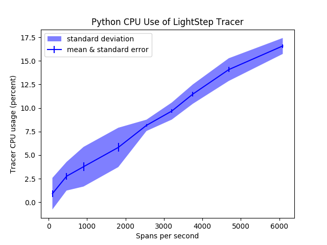

# CI

lightstep-benchmarks tests the [LightStep Python Tracer](https://github.com/lightstep/lightstep-tracer-python) and the [LightStep Python / C++ Tracer](https://github.com/lightstep/lightstep-tracer-cpp) in two ways:

1. Regression tests are run automatically on CircleCI each time code is pushed.
2. Performance graphs can be generated on CircleCI if you manually approve the jobs to run. More info on that [here](https://circleci.com/docs/2.0/workflows/#holding-a-workflow-for-a-manual-approval).

## Performance Graphs

Performance graphs are fairly expensive to generate, and don't have a simple pass / fail mechanism. For these reasons they aren't generated each time code is pushed automatically. They are only generated when the job "approve_make_graphs" is manually approved in CircleCI.

### Unreliable Satellite Graphs

These graphs display information about how the tracer's memory footprint is impacted when satellites disconnecting and reconnecting from tracers. Four distinct test are run during which tracers report fifty spans per second for ninety seconds. Results are displayed in four distinct graphs:

- **NoOp Test**: Memory use of the NoOp tracer is plotted.
- **LightStep Tracer Test**: Memory use of the LightStep tracer is plotted.
- **Satellite Disconnect Test**: Memory use of the LightStep tracer is plotted. All mock satellites are shutdown 30 seconds into the test, indicated by a red line in the plot.
- **Satellite Reconnect Test**: Memory use of the LightStep tracer is plotted. All mock satellites are shutdown 30 seconds into the test, then started again 60 seconds into the test.

### Memory Graph

This graph provides insight into how the tracer's memory footprint grows over time when spans are sent at different rates. Memory footprint is plotted over a fifty second test. Trials are run for 100, 500, 1000, and 2000 spans per second.

### CPU Graphs

These graphs provide insight into how the much CPU the LightStep tracer library uses under different conditions (varying spans per second). The different span rates, a baseline CPU usage is determined by using a NoOp tracer. A similar measurement is made using a LightStep tracer. The difference in CPU usage between the NoOp tracer and the LightStep tracer is the CPU usage of the LightStep tracer.

### Dropped Graph

At some point, tracers will not be able to send all of the spans generated by instrumented code and will be forced to drop spans. This graphs displays the results of tests where the LightStep tracer was forced to send increasingly more spans to determine at what point spans are dropped.

## Regression Tests

Regression tests are automatically run on the python and python cpp tracers each time code is pushed. The tests check the following:

- Running a tracer for 100s (emitting 500 spans per second) shouldn't use more than twice as much memory as running a tracer for 5s.
- The tracer shouldn't drop any spans if we're just sending 300 spans per second.
- A test program which generates 500 spans per second is calibrated to run at 70% CPU using a NoOp tracer. The same program shouldn't exceed 80% cpu usage when a LightStep tracer is used.
- The LightStep tracer should be able to send 3000 spans per second before the tracer (not the whole program) consumes 10% CPU.

You can also run the regression tests manually from the command-line. First, make sure that you have setup the development environment (see this section). To test the pure python tracer: `pytest --client_name python regression_tests.py`. To test the cpp python tracer: `pytest --client_name python regression_tests.py`.
