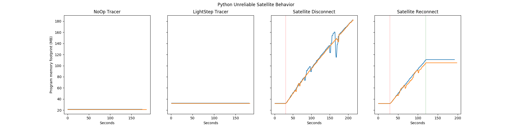

# LightStep Benchmarks CI Integration

LightStep Benchmarks tests the [Python Tracer](https://github.com/lightstep/lightstep-tracer-python) and the [Python Streaming Tracer](https://github.com/lightstep/lightstep-tracer-cpp) in two ways:

1. Regression tests are run automatically on CircleCI each time code is pushed.
2. Performance graphs can be generated on CircleCI if you manually approve the jobs to run (more info on how to approve a job [here](https://circleci.com/docs/2.0/workflows/#holding-a-workflow-for-a-manual-approval)).

LightStep Benchmarks is currently integrated into the legacy Python Tracer and Streaming Python Tracer's CI pipelines.

## Performance Graphs

Performance graphs are fairly expensive to generate, and don't have a simple pass / fail mechanism. For these reasons they aren't generated each time code is pushed automatically. They are only generated when the job "approve_make_graphs" is manually approved in CircleCI. We'll now explain each performance graph which can be generated in detail:

### Unreliable Satellite Graphs

These graphs display information about how a traced client program's memory footprint is impacted by Satellites disconnecting and reconnecting from tracers. The raw data from these tests are saved as CI artifacts. Four distinct tests are run during which tracers report 50 spans per second for 180 seconds. Results are displayed in four distinct graphs:

- **NoOp Test**: Memory use of the NoOp tracer is plotted.
- **LightStep Tracer Test**: Memory use of a LightStep tracer is plotted.
- **Satellite Disconnect Test**: Memory use of a LightStep tracer is plotted. Mock Satellites are shutdown 30 seconds into the test, indicated by a red line in the plot.
- **Satellite Reconnect Test**: Memory use of a LightStep tracer is plotted. Mock Satellites are shutdown at the red line 30 seconds into the test, then started at the green line 120 seconds into the test.

### Memory Graph

This graph provides insight into how a traced client program's memory footprint grows over time when spans are sent at different rates. Memory footprint is plotted over a fifty second test. Trials are run for 100, 500, 1000, and 2000 spans per second. The raw data from these tests are saved as CI artifacts.

### CPU Graphs

These graphs provide insight into how the much CPU a LightStep tracer library uses under different conditions (varying spans per second). The raw data from these tests are saved as CI artifacts. For each a variety of span rates a baseline CPU usage is calculated by using a NoOp traced client program. A similar measurement is then made using a LightStep traced client program. The difference in CPU usage between the NoOp traced client and the LightStep traced client is equal to the CPU usage of the LightStep tracer.

### Dropped Graph

At some point, tracers will not be able to send all of the spans generated by instrumented code and will be forced to drop spans. This graphs displays the results of a test where a LightStep tracer was forced to send increasingly more spans to determine whether spans are dropped.

## Regression Tests

Regression tests are automatically run on the legacy Python and Streaming Python tracers each time code is pushed. The tests make sure that:

- Running a tracer for 100s (emitting 500 spans per second) doesn't use more than twice as much memory as running a tracer for 5s.
- The tracer doesn't drop any spans if instrumented code is only generating 300 spans per second.
- A test program generating 500 spans per second calibrated to run at 70% CPU using a NoOp tracer doesn't exceed 80% cpu usage when a LightStep tracer is used.
- The LightStep tracer is able to send 3000 spans per second before the tracer (not the whole program) consumes 10% CPU.

You can also run the regression tests manually from the command-line. First, make sure that you have setup the development environment (see the section in the README). To test the pure python tracer: `pytest --client_name python regression_tests.py`. To test the cpp python tracer: `pytest --client_name python-cpp regression_tests.py`.
